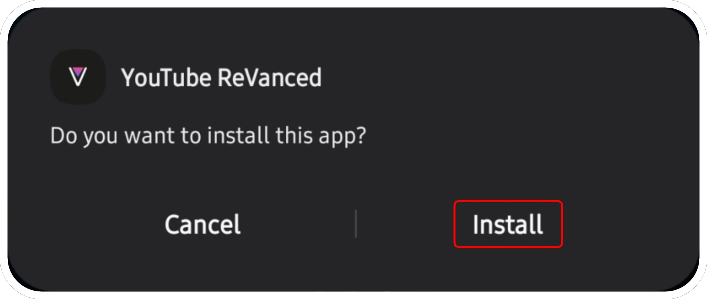
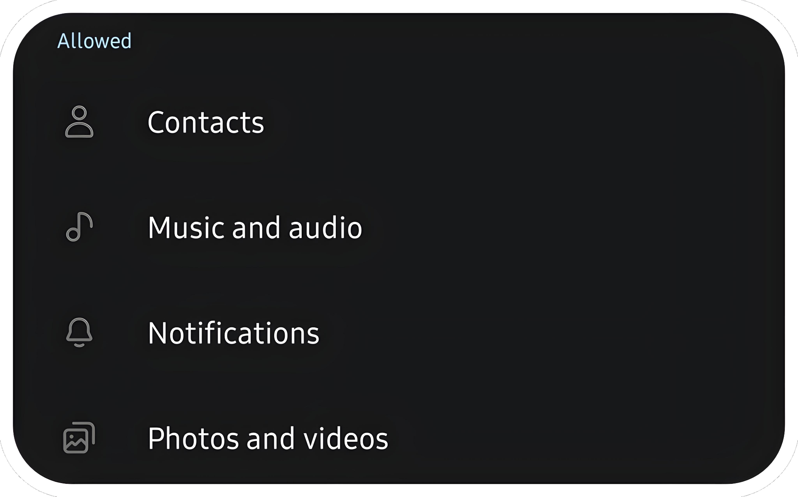

# <p align="center">How to install apps?

### For installing with ReVanced Manager, please [follow this tutorial](https://mega.nz/file/3SAjiIxQ#0dWhhwk5TIEMRz4jct2ztZA1w-bbotf8tEBEzxd1C1Y)
Links: [ReVanced Manager](https://github.com/ReVanced/revanced-manager/releases/latest), [GMSCore](https://github.com/ReVanced/GmsCore/releases//latest).
#
### For installing with ReVancify, please [follow this tutorial](https://mega.nz/file/vaoTALpD#6ZMQ6DpYWIbXPu6u_s0X5MghSS_J26duI574NCNa8ME)
Links: [Termux](https://github.com/termux/termux-app/releases/latest), [GMSCore](https://github.com/ReVanced/GmsCore/releases/latest).

Copy/Past this command: After installation, type ```revancify``` in termux and press enter.
```console
curl -sL "https://raw.githubusercontent.com/decipher3114/Revancify/main/install.sh" | bash
```
#
### For installing with this builder, please [follow this tutorial](https://github.com/Kevinr99089/Extended.Builder/blob/main/install.md#for-installing-with-this-builder-please-follow-this-tutorial)

> **The signatures are different from ReVanced Manager. You must uninstalling the application patched by RV Manager for use these releases (export your settings before uninstalling it).**
#

Go to [Releases](https://github.com/kevinr99089/Extended.Builder) page, scroll down and click on the application you want (For my exemple, YT-ReReX), then on GMSCore (required for use these mods):


and click on app.revanced.android.gms-xxxxxxxxx-signed.apk :


---

This step is optional, but if the applications refuse to install, it's possible that Play Protect is blocking the installation. In this case, and **only in this case**, follow this step.


Go to Play Store, click on your profile picture and press :


Click on "No harmful apps found"


Click on the gear at the top right of the screen :


and disable "Scan apps with Play Protect" :


If you had to disable it to install these applications, reactivate it once all the steps are finished.

---

click (in the notification bar) on app.revanced.android.[...].apk first


if you have never installed applications from the Web, you need to Enable in the settings "Unknown Sources"


and allow permission for install apps :


Another pop-up will appear, click on "install".


Once microG Services is installed, click on OK and click on YT-ReReX (in the notification bar) and click on "Install"



Once done, Go to Home screen (or Settings > Apps), and go to microG Services settings :


Go to permissions settings :


and enable everything :



Return to the previous menu and disable battery optimizations :


and you're done. In YT-ReReX, click on the top right corner and click on "+" to sign in to your Google account.
