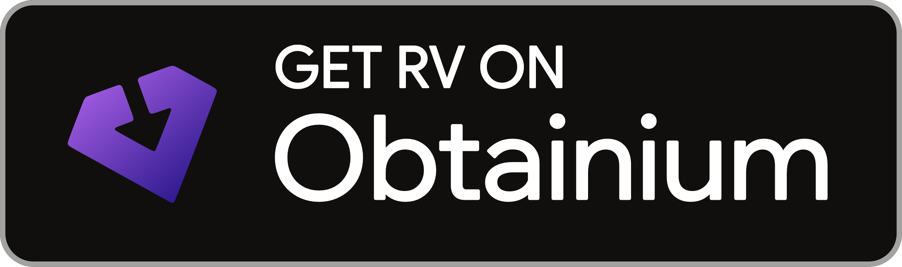
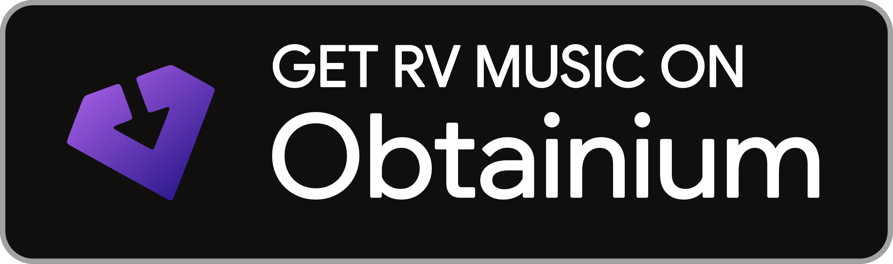
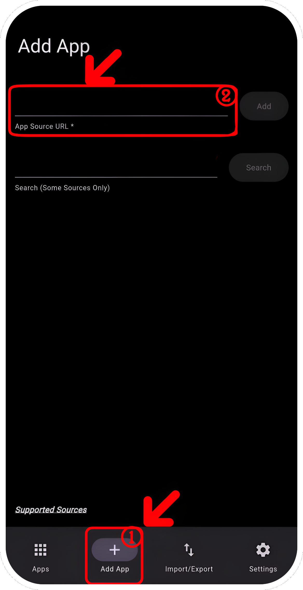
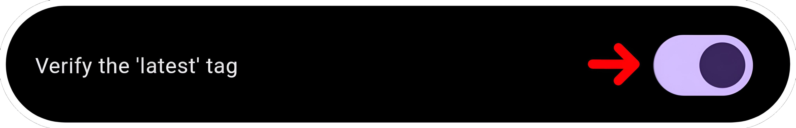
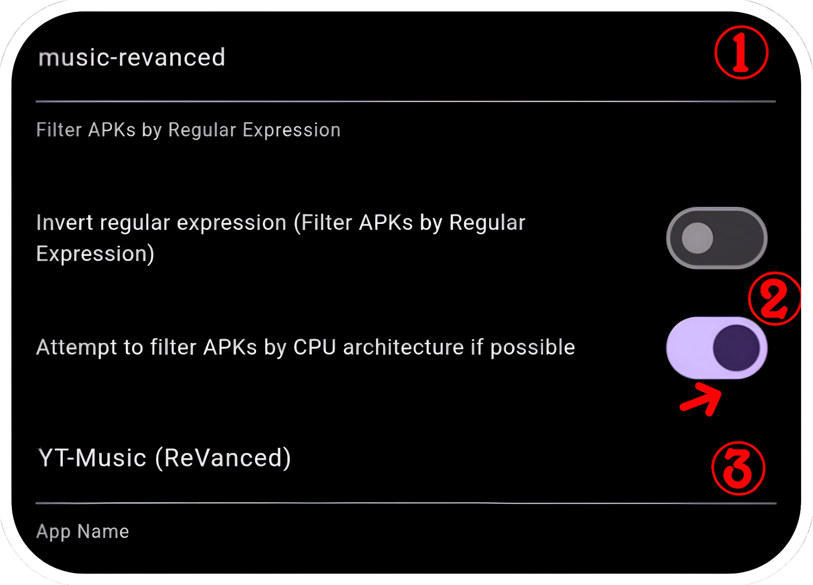

# <p align="center">How to install apps?

### For installing with ReVanced Manager, please [follow this tutorial](https://mega.nz/file/3SAjiIxQ#0dWhhwk5TIEMRz4jct2ztZA1w-bbotf8tEBEzxd1C1Y)
Links: [ReVanced Manager](https://github.com/ReVanced/revanced-manager/releases/latest), [MicroG](https://github.com/WSTxda/MicroG-RE/releases/latest).
#
### For installing with ReVancify, please [follow this tutorial](https://mega.nz/file/vaoTALpD#6ZMQ6DpYWIbXPu6u_s0X5MghSS_J26duI574NCNa8ME)
Links: [Termux](https://github.com/termux/termux-app/releases/latest), [MicroG](https://github.com/WSTxda/MicroG-RE/releases/latest).

Copy/Past this command: After installation, type ```revancify``` in termux and press enter.
```console
curl -sL "https://raw.githubusercontent.com/decipher3114/Revancify/main/install.sh" | bash
```
#
### For installing with this builder, please [follow this tutorial](https://github.com/Kevinr99089/ReVanced.Builder/blob/main/install.md#for-installing-with-this-builder-please-follow-this-tutorial)

> **The signatures are different from ReVanced Manager. You must uninstalling the application patched by RV Manager for use these releases from installation methods below (export your settings before uninstalling it).**
#
<details>
  <summary>No auto update</summary>

Go to [Releases](https://github.com/kevinr99089/ReVanced.Builder) page, scroll down and click on the application you want (For my exemple, YT-ReVanced), then on [MicroG-RE](https://github.com/WSTxda/MicroG-RE/releases/latest) (required for use these mods):


and click on MicroG_RE_x.x.apk :


---

<details>
      <summary>
Disabling Play Protect is necessary if, **only if** application refuse to be installed.</summary>

Go to Play Store, click on your profile picture in the top right-hand corner, then click on "Manage app & device"  :


then on "No harmful apps found"


Click on the settings icon In the top right-hand corner of the screen :


and disable "Scan apps with Play Protect" :


Remember to re-enable it if you had to disable it to install applications.

</details>

Install all apps
<details>
      <summary>
If you've never installed an application from the internet</summary>

First install on MicroG_RE_X.X.apk in the notification bar and yt-revanced-vxx.xx.xx-all.apk:


Click on the application you've just downloaded in the notification bar, if you have never installed applications from the Web, you need to enable 'Unknown Sources' in settings:


and allow permission: 


 then install app :


Once microG Services is installed, click on OK and click on YT-ReVanced (in the notification bar) and click on "Install"


</details>

---

Once done, Go to Home screen (or Settings > Apps), and go to MicroG settings :


Go to permissions :


and enable everything :


Return to the previous menu and go to battery: 


and set this app as 'Unrestricted' :


and you're done. Now open YT, go to library and click "+" to sign in to your Google account.

</details>
<details>
    <summary>Auto update (Obtainium)</summary>

> This installation method was inspired by peternmuller, [Support his efforts](https://github.com/kevinr99089/ReVanced.Builder/?tab=readme-ov-file#-thanks-to-).

#

If you'd like to use Obtainium to easily manage apps and updates, you can download it here

[](https://github.com/ImranR98/Obtainium/releases/latest/download/app-release.apk)

<details>
      <summary>
If you've never installed an application from the internet</summary>
Click on the application you've just downloaded in the notification bar, if you have never installed applications from the Web, you need to enable 'Unknown Sources' in settings:


and allow permission: 


 then install app :


</details>

<details>
      <summary>
Disabling Play Protect is necessary if, **only if** application refuse to be installed.</summary>

Go to Play Store, click on your profile picture in the top right-hand corner, then click on "Manage app & device"  :


then on "No harmful apps found"


Click on the settings icon In the top right-hand corner of the screen :


and disable "Scan apps with Play Protect" :


Remember to re-enable it if you had to disable it to install applications.

</details>

---
<details>
    <summary>Pre-configured</summary>

once installed, select the application for which you wish to add a pre-configuration. (MicroG is required to use RV and/or RV Music).

[](https://apps.obtainium.imranr.dev/redirect?r=obtainium://app/%7B%22id%22%3A%22app.revanced.android.youtube%22%2C%22url%22%3A%22https%3A%2F%2Fgithub.com%2Fkevinr99089%2FReVanced.Builder%22%2C%22author%22%3A%22kevinr99089%22%2C%22name%22%3A%22YouTube%20ReVanced%22%2C%22preferredApkIndex%22%3A0%2C%22additionalSettings%22%3A%22%7B%5C%22includePrereleases%5C%22%3Afalse%2C%5C%22fallbackToOlderReleases%5C%22%3Atrue%2C%5C%22filterReleaseTitlesByRegEx%5C%22%3A%5C%22%5C%22%2C%5C%22filterReleaseNotesByRegEx%5C%22%3A%5C%22%5C%22%2C%5C%22verifyLatestTag%5C%22%3Atrue%2C%5C%22dontSortReleasesList%5C%22%3Afalse%2C%5C%22useLatestAssetDateAsReleaseDate%5C%22%3Afalse%2C%5C%22releaseTitleAsVersion%5C%22%3Afalse%2C%5C%22trackOnly%5C%22%3Afalse%2C%5C%22versionExtractionRegEx%5C%22%3A%5C%22%5C%22%2C%5C%22matchGroupToUse%5C%22%3A%5C%22%5C%22%2C%5C%22versionDetection%5C%22%3Afalse%2C%5C%22releaseDateAsVersion%5C%22%3Afalse%2C%5C%22useVersionCodeAsOSVersion%5C%22%3Afalse%2C%5C%22apkFilterRegEx%5C%22%3A%5C%22yt-revanced%5C%22%2C%5C%22invertAPKFilter%5C%22%3Afalse%2C%5C%22autoApkFilterByArch%5C%22%3Afalse%2C%5C%22appName%5C%22%3A%5C%22RV%5C%22%2C%5C%22shizukuPretendToBeGooglePlay%5C%22%3Afalse%2C%5C%22allowInsecure%5C%22%3Afalse%2C%5C%22exemptFromBackgroundUpdates%5C%22%3Afalse%2C%5C%22skipUpdateNotifications%5C%22%3Afalse%2C%5C%22about%5C%22%3A%5C%22%5C%22%7D%22%2C%22overrideSource%22%3Anull%7D) [](https://apps.obtainium.imranr.dev/redirect?r=obtainium://app/%7B%22id%22%3A%22app.revanced.android.apps.youtube.music%22%2C%22url%22%3A%22https%3A%2F%2Fgithub.com%2Fkevinr99089%2FReVanced.Builder%22%2C%22author%22%3A%22kevinr99089%22%2C%22name%22%3A%22YouTube%C2%A0Music%22%2C%22preferredApkIndex%22%3A0%2C%22additionalSettings%22%3A%22%7B%5C%22includePrereleases%5C%22%3Afalse%2C%5C%22fallbackToOlderReleases%5C%22%3Atrue%2C%5C%22filterReleaseTitlesByRegEx%5C%22%3A%5C%22%5C%22%2C%5C%22filterReleaseNotesByRegEx%5C%22%3A%5C%22%5C%22%2C%5C%22verifyLatestTag%5C%22%3Atrue%2C%5C%22dontSortReleasesList%5C%22%3Afalse%2C%5C%22useLatestAssetDateAsReleaseDate%5C%22%3Afalse%2C%5C%22releaseTitleAsVersion%5C%22%3Afalse%2C%5C%22trackOnly%5C%22%3Afalse%2C%5C%22versionExtractionRegEx%5C%22%3A%5C%22%5C%22%2C%5C%22matchGroupToUse%5C%22%3A%5C%22%5C%22%2C%5C%22versionDetection%5C%22%3Afalse%2C%5C%22releaseDateAsVersion%5C%22%3Afalse%2C%5C%22useVersionCodeAsOSVersion%5C%22%3Afalse%2C%5C%22apkFilterRegEx%5C%22%3A%5C%22music-revanced%5C%22%2C%5C%22invertAPKFilter%5C%22%3Afalse%2C%5C%22autoApkFilterByArch%5C%22%3Atrue%2C%5C%22appName%5C%22%3A%5C%22RV%20Music%5C%22%2C%5C%22shizukuPretendToBeGooglePlay%5C%22%3Afalse%2C%5C%22allowInsecure%5C%22%3Afalse%2C%5C%22exemptFromBackgroundUpdates%5C%22%3Afalse%2C%5C%22skipUpdateNotifications%5C%22%3Afalse%2C%5C%22about%5C%22%3A%5C%22%5C%22%7D%22%2C%22overrideSource%22%3Anull%7D) [](https://apps.obtainium.imranr.dev/redirect?r=obtainium://app/%7B%22id%22%3A%22app.revanced.android.gms%22%2C%22url%22%3A%22https%3A%2F%2Fgithub.com%2FWSTxda%2FMicroG-RE%22%2C%22author%22%3A%22WSTxda%22%2C%22name%22%3A%22MicroG%22%2C%22preferredApkIndex%22%3A0%2C%22additionalSettings%22%3A%22%7B%5C%22includePrereleases%5C%22%3Afalse%2C%5C%22fallbackToOlderReleases%5C%22%3Atrue%2C%5C%22filterReleaseTitlesByRegEx%5C%22%3A%5C%22%5C%22%2C%5C%22filterReleaseNotesByRegEx%5C%22%3A%5C%22%5C%22%2C%5C%22verifyLatestTag%5C%22%3Atrue%2C%5C%22dontSortReleasesList%5C%22%3Afalse%2C%5C%22useLatestAssetDateAsReleaseDate%5C%22%3Afalse%2C%5C%22releaseTitleAsVersion%5C%22%3Afalse%2C%5C%22trackOnly%5C%22%3Afalse%2C%5C%22versionExtractionRegEx%5C%22%3A%5C%22%5C%22%2C%5C%22matchGroupToUse%5C%22%3A%5C%22%5C%22%2C%5C%22versionDetection%5C%22%3Afalse%2C%5C%22releaseDateAsVersion%5C%22%3Afalse%2C%5C%22useVersionCodeAsOSVersion%5C%22%3Afalse%2C%5C%22apkFilterRegEx%5C%22%3A%5C%22MicroG_RE%5C%22%2C%5C%22invertAPKFilter%5C%22%3Afalse%2C%5C%22autoApkFilterByArch%5C%22%3Atrue%2C%5C%22appName%5C%22%3A%5C%22MicroG-RE%20(GMSCore)%5C%22%2C%5C%22shizukuPretendToBeGooglePlay%5C%22%3Afalse%2C%5C%22allowInsecure%5C%22%3Afalse%2C%5C%22exemptFromBackgroundUpdates%5C%22%3Afalse%2C%5C%22skipUpdateNotifications%5C%22%3Afalse%2C%5C%22about%5C%22%3A%5C%22%5C%22%7D%22%2C%22overrideSource%22%3Anull%7D)

Perfect, theses applications are ready to install. Just click on the download icon on the applications:


Once done, Go to Home screen (or Settings > Apps), and go to MicroG settings :


Go to permissions :


and enable everything :


Return to the previous menu and go to battery: 


and set this app as 'Unrestricted' :


and you're done. Now open YT, go to library and click "+" to sign in to your Google account.

---
</details>

<details>
   <summary>Manual configuration</summary>
once installed, open Obtainium, the application looks complicated, but it's not.
Click on Add App, and paste this link into App Source URL *:

  ```console
https://www.github.com/Kevinr99089/ReVanced.Builder
```



Once pasted, settings will open. Check "Verify the 'latest' tag":



Scroll a little more and in "Regular Expression", type "yt-revanced", uncheck "Attempt to filter APKs by CPU architecture if possible" and type the name you want (optional):


Scroll up again and click on "Add":


<details>
    <summary>install YT-Music (optional)</summary>

Click again on "Add App", and paste this link into App Source URL *:
```console
https://www.github.com/Kevinr99089/ReVanced.Builder
```
Check again "Verify the 'latest' tag":


Scroll down and in "Regular Expression", type "music-revanced", check "Attempt to filter APKs by CPU architecture if possible" and type the name you want (optional):



Scroll up and click on "Add"


</details>

Click for the last time on "Add App", and paste this link into App Source URL *:
```console
https://github.com/WSTxda/MicroG-RE
```
Check "Verify the 'latest' tag":


Since this release has only one application, don't set "Regular Expressions", uncheck "Attempt to filter APKs by CPU architecture if possible" and type the name you want (optional):


and type "Add"


Perfect, theses applications are ready to install. Just click on the download icon on the applications:


Once done, Go to Home screen (or Settings > Apps), and go to MicroG settings :


Go to permissions :


and enable everything :


Return to the previous menu and go to battery: 


and set this app as 'Unrestricted' :


and you're done. Now open YT, go to library and click "+" to sign in to your Google account.

---
</details>

<details>
    <summary>About Regular Expressions on Obtainium</summary>

  Obtainium can be used on other repositories or other sites, regular expressions can be useful.

  Q- What are regular expressions?

  A- Regular expressions can be used to filter applications in releases (particularly useful when a release contains several applications) :

  

In the example, there are 2 applications `yt-revanced` and `music-revanced`.
If you choose `yt-revanced` as the regular expression, Obtainium will suggest all applications containing this name, or (as in the example) automatically choose and download this application instead of asking you for it with each new release. By clicking on "invert regular expression", it will suggest all applications not containing `yt-revanced` in the name (in my example, it will download `music-revanced` by default).

However, avoid selecting the application version as a regular expression, because in case of update, the requested version may no longer be available.

More information here: https://github.com/ImranR98/Obtainium/wiki#basics .

In addition to regular expressions, Obtainium is useful for facilitating installation, checking for updates regularly (according to the duration selected in the app settings), and sending you a notification to let you know when an update is available for your applications. You can combine it with Shizuku to automate the installation of updates. however, when there is more than one release, it may not install automatically.
